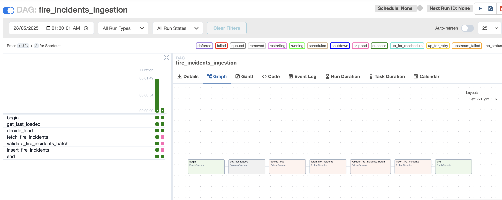
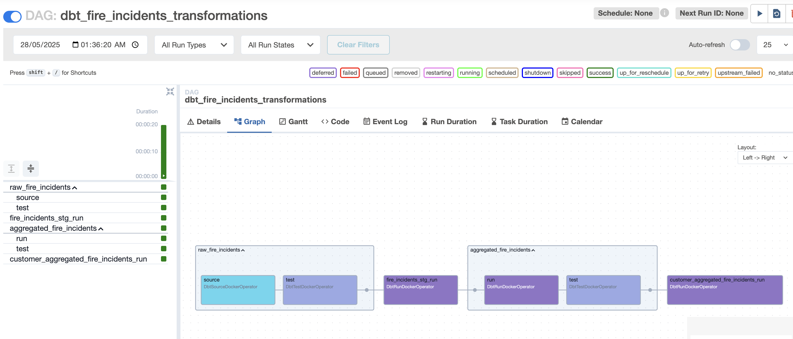
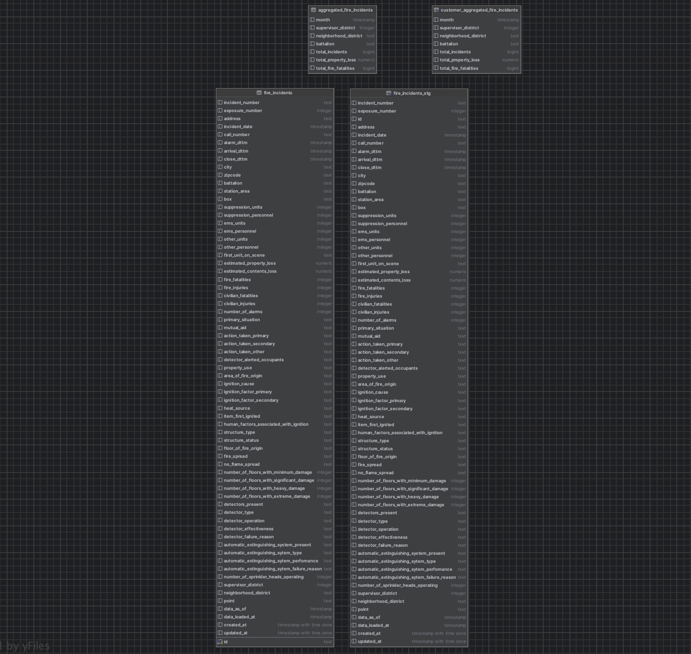
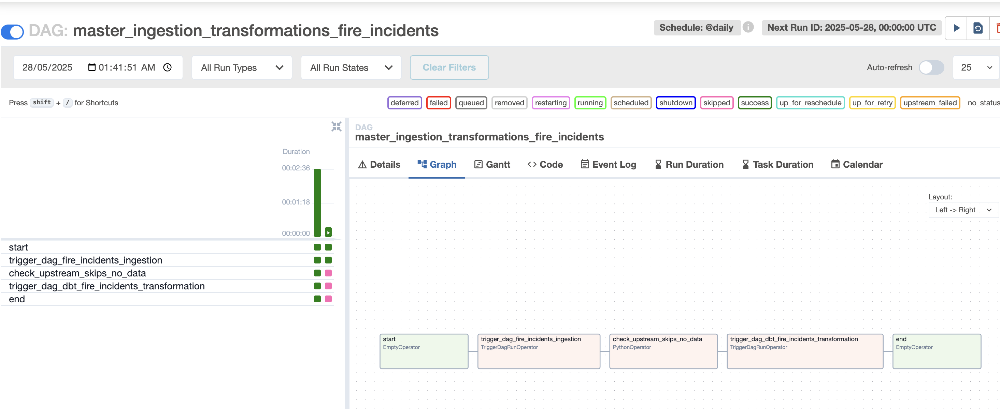

# Data Engineering Solution: Usage and Architecture Report

## Overview

This project delivers a robust, containerized data engineering solution for fire incident analytics, leveraging **Docker** for reproducibility and portability. The architecture is designed for modularity, maintainability, and data quality, using **Apache Airflow** for orchestration, **dbt** for transformations, and **Postgres** as the data warehouse.

---

## Containerization and Reproducibility

All components—Airflow, dbt, and Postgres—are containerized using Docker. This ensures:
- **Easy deployment**: The entire stack can be started with a single `docker-compose up --build` command.
- **Reproducibility**: The environment is consistent across machines and developers.
- **Separation of concerns**: Each service (Airflow, dbt, Postgres) runs in its own container, following best practices for modern data engineering.

---

## Data Warehouse: Medallion Architecture

The data warehouse is implemented in Postgres (`fire_incidents_db_dev`) and follows a **medallion architecture** with three layers:

- **Raw**: Stores ingested data as-is from the source API.
- **Refined**: Contains cleaned, deduplicated, and transformed data, ready for analytics and BI.
- **Curated**: Provides business-ready views, including data masking or filtering for specific use cases.

**User Management**:
- Two dedicated users are created:  
  - `airflow` (for DAG operations)
  - `dbt` (for dbt transformations)
- Each user has appropriate privileges on the relevant schemas.

---

## Raw Layer (ingestion)

- **Orchestration**: Managed by Airflow DAGs, using PythonOperators and PostgresOperators.
- **Source**: Data is fetched from the [San Francisco Fire Incidents API](https://dev.socrata.com/foundry/data.sfgov.org/wr8u-xric) (requires an API token).
- **Data Quality**: Before ingestion, data is validated using **Great Expectations**:
  - Ensures required columns exist, values are not null, and IDs are unique.
  - Prevents duplication and updates records as needed (see the insert task in the ingestion DAG).
- **Ingestion Logic**:  
  - Data is inserted into the `raw` schema.
  - If a record already exists, it is updated to maintain the latest information.

**Important:**  
To make Airflow work for ingestion:
- Use `admin` as the username and the value stored in `standalone_admin_password.txt` for the password for logging into Airflow.
- **Turn on (unpause) the relevant DAGs in the Airflow UI.**
- **Add your API token as an Airflow Variable** named `FIRE_INCIDENTS_API_TOKEN` (otherwise the ingestion DAG will not be displayed or will fail).

---

## Transformations: 
### Refined Layer
 - A staging view (`fire_incidents_stg`) is created to deduplicate records from the raw table.
  - An aggregated table (`aggregated_fire_incidents`) is built for BI and analytics, materialized as tables in the refined schema.
  - dbt tests are applied to ensure data quality and integrity.
  `standalone_admin_password.txt`

#### Notes
  - **Freshness Validation**: dbt checks the freshness of the raw data before running transformations. Warnings are raised if data is older than 30 days; errors if older than 90 days.
  - Additional data tests are performed on the raw table to ensure ongoing integrity.

### Curated Layer

- **Purpose**: Provides business-ready views for specific use cases or customers.
- **Example**: The curated view excludes incidents from "Treasure Island" to demonstrate data masking and customer-specific filtering.

---

## Orchestration and Integration

- **Airflow triggers dbt**: Airflow DAGs orchestrate the entire pipeline, including triggering dbt transformations as separate containerized processes.
- **Master DAG:**  
  A master DAG (`master_ingestion_transformations_fire_incidents`) coordinates the end-to-end process. It first triggers the ingestion DAG to fetch and validate new data. If new data is available and successfully ingested, the master DAG then triggers the dbt transformation process. This ensures that transformations only occur when there is fresh data to process. The master DAG is scheduled to run daily, aligning with the refresh frequency of the source data.

- **Separation of Concerns:**  
  The ingestion and transformation processes are decoupled and run in separate containers. Airflow triggers dbt transformations as independent jobs, ensuring resource isolation and scalability.

- **Cosmos Integration**: The [Cosmos](https://github.com/astronomer/astronomer-cosmos) library is used to seamlessly integrate dbt with Airflow, allowing dbt runs to be managed and monitored as native Airflow tasks.

---

## Final Remarks

- The entire solution is **modular, scalable, and production-ready**.
- All processes are **containerized** for easy deployment and reproducibility.
- **Data quality** is enforced at multiple stages using Great Expectations and dbt tests.
- The **medallion architecture** ensures clear separation between raw, refined, and curated data, supporting robust analytics and governance.
- **dbt transformations are triggered by Airflow** but run in a separate container, ensuring resource isolation and scalability.

For further details on local development, cleaning, and advanced usage, refer to the individual README files in each subfolder.